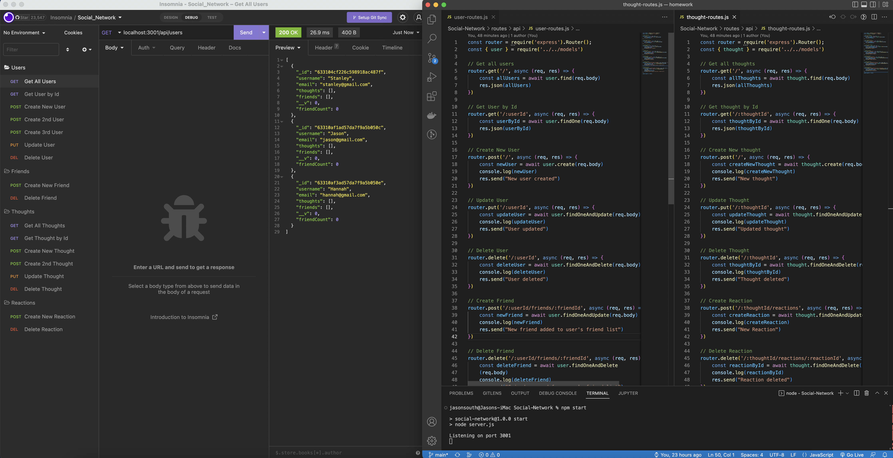

# Social-Network
## Demo

Click on the following link to deploy this 
<a href="https://drive.google.com/file/d/1l7ceHamiu1upf0JJrec58jbvg4lV7UH9/view" title="Social_Network">Social_Network</a> app

## Table of Content
- [Description](#description)
- [Usage Information](#usage)
- [License](#license)
- [Contributor](#contributor)
- [Contact Information](#contact)

## Description

This is a social network web application where users can share their thoughts, react to friends’ thoughts, and create a friend list by building API routes using NoSQL.    

## Usage

Enter "npm start" from the CLI and press enter, then you can test the API routes using Insomnia through the localhost.

## License

[ISC](https://choosealicense.com/licenses/isc/) license

## Contributor

Jason South

## Contact
Jason South  
GitHub username: jsouth75  
Email: jason.south@me.com

